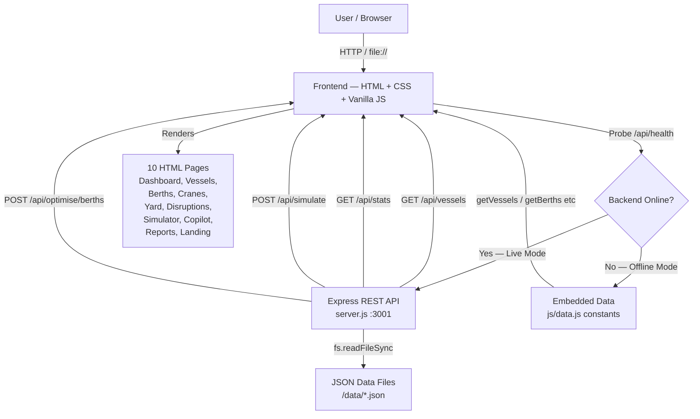

# Architecture

## System Architecture



## Components

| Component | Technology | Responsibility |
|---|---|---|
| Frontend Pages | HTML5 + CSS3 | 10 pages — landing, dashboard, vessels, berths, cranes, yard, disruptions, simulator, copilot, reports |
| Design System | CSS Custom Properties | Dark enterprise theme — colours, typography, spacing, all in one `:root` block |
| App Shell | `js/app.js` | Sidebar collapse, navigation active state, notification panel, toasts, modals, shared utilities |
| Data Layer | `js/data.js` | Embedded JS constants (30 vessels, 10 berths, 15 cranes, 6 yard zones, 10 disruptions, 8 notifications) |
| API Client | `js/api.js` | Probes backend on load; routes all data calls to Express if online, falls back to `data.js` if offline |
| Backend API | Node.js + Express | 17 REST endpoints — GET data, POST simulation/optimisation/actions |
| AI Risk Engine | `js/vessels.js` | Rule-based risk scoring 0–100 from 14 risk factors with human-readable explanations |
| Congestion Engine | `js/data.js` | `getPortCongestionRisk()` — weighted formula using berth/vessel/yard/disruption state |
| Simulator | `js/simulator.js` | Crisis scenario modelling — before/after metrics + 5-step response plans per disruption type |
| Copilot | `js/copilot.js` | Intent detection (12 categories) → structured HTML response built from live data |
| Report Generator | `js/reports.js` | 3 report types built programmatically from live data; print/PDF via `window.print()` |

## Data Flow — Vessel Risk Score

```
1. Vessel arrives in data layer (data.js / API)
2. vessels.js reads vessel.riskFactors[] array
3. getVesselRecommendation() maps per-vessel overrides
4. Risk score (0–100) displayed with contributing factors
5. getRiskClass(score) → 'critical' | 'high' | 'medium' | 'low'
6. buildBadge() + buildRiskBar() render visual indicators
```

## Data Flow — Crisis Simulation

```
1. User selects: type, severity, duration, area
2. runSimulation() computes severity multiplier × duration factor
3. Special case: Weather + High + 12h → exact demo numbers (31 vessels, 87%, 11.6h, 82%)
4. RESPONSE_PLANS[type] provides 5-step AI response plan
5. Results rendered as before/after card + numbered plan
6. POST /api/simulate mirrors this logic server-side
```

## Data Flow — AI Copilot

```
1. User types query (or clicks suggestion button)
2. detectIntent(query) pattern-matches to 1 of 12 intent categories
3. buildResponse(intent, query) assembles structured HTML
4. Response drawn from live data via getVessels(), getBerths(), etc.
5. Typing indicator shown for 1.1–1.5s (simulated AI latency)
6. Response appended as chat bubble with ai-disclaimer footer
```

## File Dependency Map

```
data.js  ──► (loaded first — defines all data + helper functions)
   │
app.js   ──► (loaded second — uses data.js helpers, defines shared UI utilities)
   │
api.js   ──► (loaded third — probes backend, wraps data.js functions in async API)
   │
[page].js ──► (loaded last — uses all of the above)
```

## Backend API Routes

| Method | Path | Handler |
|---|---|---|
| GET | `/api/health` | Returns server status + data counts |
| GET | `/api/vessels` | Filters: `?status= &risk= &type= &search=` |
| GET | `/api/vessels/:id` | Single vessel lookup |
| GET | `/api/berths` | Filters: `?status=` |
| GET | `/api/berths/:id` | Single berth lookup |
| GET | `/api/cranes` | Filters: `?status=` |
| GET | `/api/cranes/:id` | Single crane lookup |
| GET | `/api/yard` | Yard summary + 6 zones |
| GET | `/api/disruptions` | Filters: `?status= &severity=` |
| GET | `/api/disruptions/:id` | Single disruption |
| GET | `/api/notifications` | Generated from live data state |
| GET | `/api/stats` | Aggregated port KPIs |
| POST | `/api/simulate` | Crisis simulation engine |
| POST | `/api/optimise/berths` | Berth optimisation |
| POST | `/api/vessels/:id/action` | Vessel action submission |
| POST | `/api/cranes/:id/reassign` | Crane reassignment |
| POST | `/api/yard/redistribute` | Yard redistribution |

## Security Considerations

- No API keys or secrets are stored in frontend code
- Backend serves the frontend as static files — no separate origin needed
- CORS is open for local development — restrict to specific origins in production
- All POST actions are acknowledged with a disclaimer ("simulation only — requires operator approval")
- `.env` is in `.gitignore` — `.env.example` provided as template
- `node_modules/` is in `.gitignore` — never committed

## Scalability Notes

The Express backend is stateless and horizontally scalable. The current JSON file reading
at startup would be replaced with database queries (PostgreSQL recommended) in production.

The frontend's separation of `data.js` (local) and `api.js` (remote) means migrating to
a production API requires only updating `API_CONFIG.baseURL` in `api.js` — no page
logic changes needed.

A WebSocket layer could replace the simulated live feed on the dashboard with real-time
vessel position updates from AIS (Automatic Identification System) data feeds.
